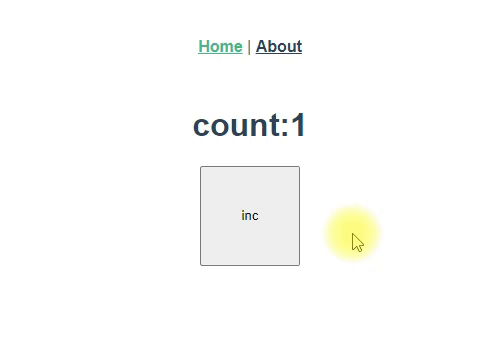

# vuex-smart-module-sample

## Project setup
```
yarn install
```

### Compiles and hot-reloads for development
```
yarn run serve
```

### Compiles and minifies for production
```
yarn run build
```

[vuex-smart-module](https://github.com/ktsn/vuex-smart-module)